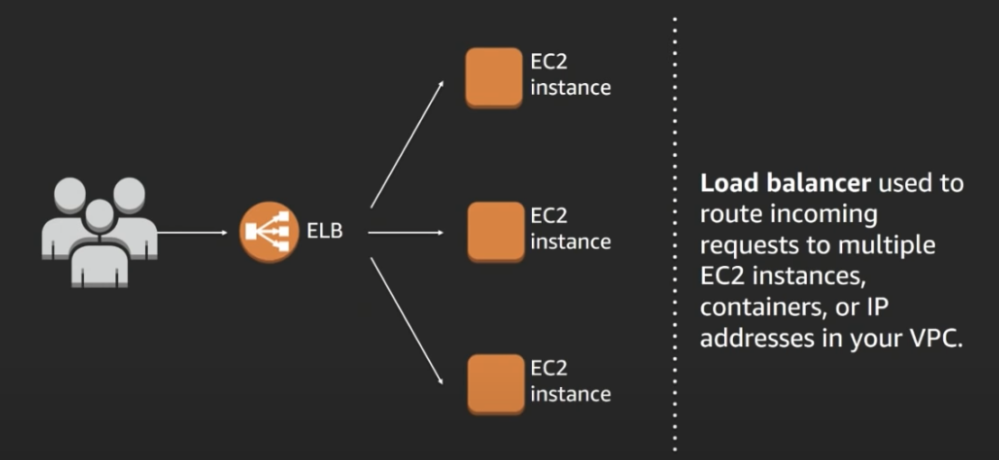
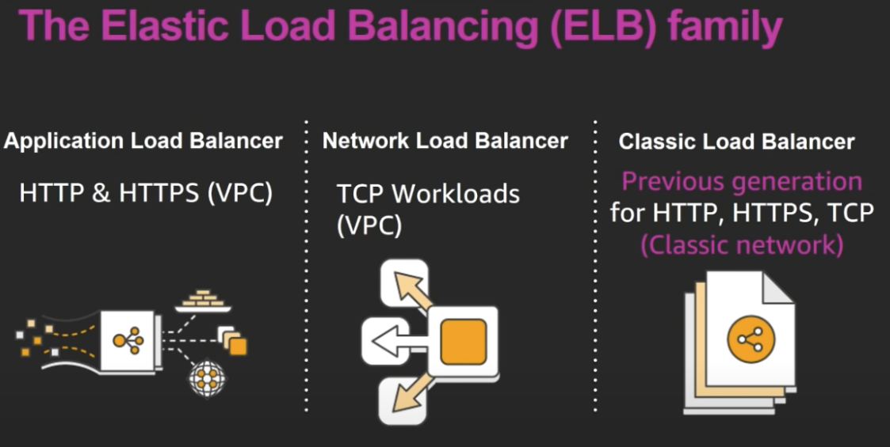
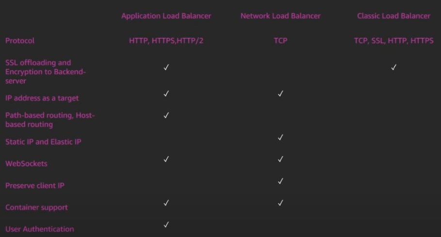
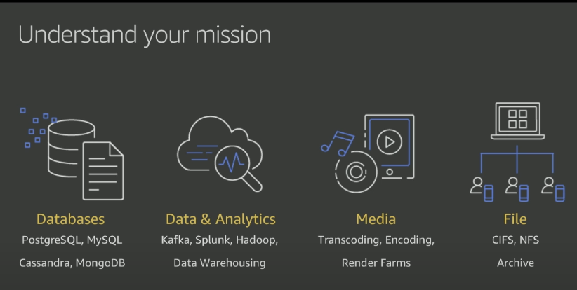
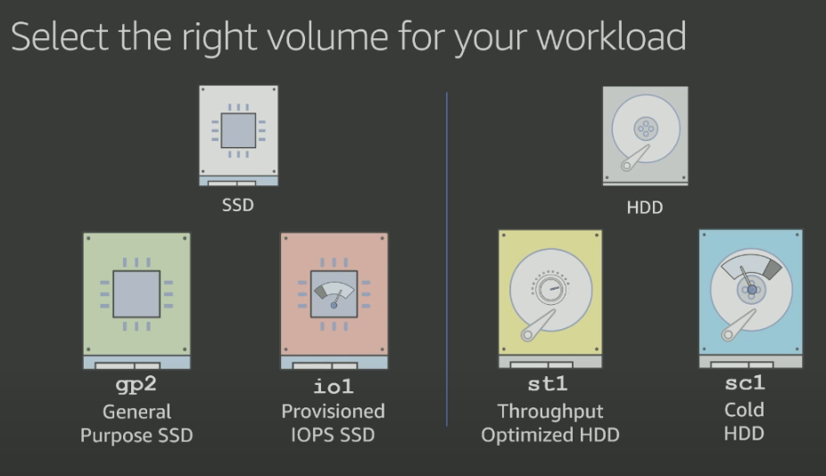
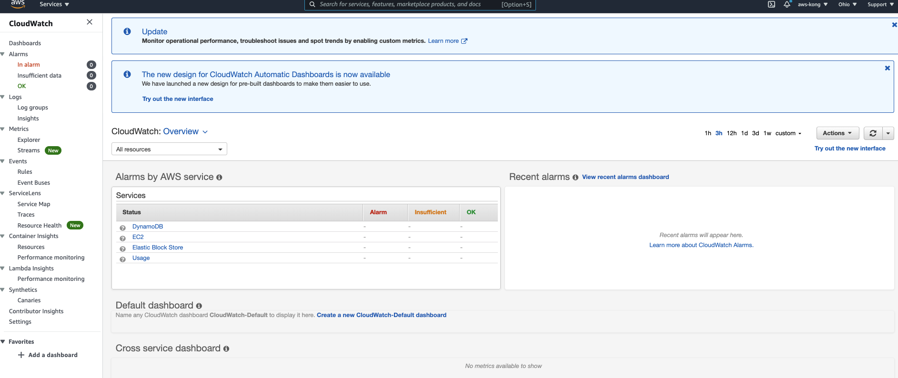
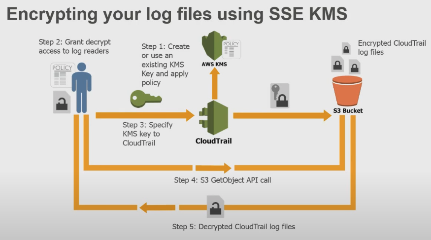

# Basics

## Global Infrastructure

Region: A separate geographical location with multiple locations that are isolated from each other

* Region 之间默认是隔离的 除非给予特定的permission
* Region 可以由你来决定 
* 每个Region

Select a Region

* Compliance with data governance and legal requirements
* Proximity to your customers
* Available services within a Region: 某个Region可能还不支持新的Service
* Pricing: 相同Service在不同Region可能价格不同

Availability Zones: a single data center or a group of data centers within a Region. Availability Zones are located tens of miles apart from each other. **A fully isolated portion of the AWS global infrastructure**.

Edge Locations

An **edge location** is a site that Amazon CloudFront uses to store cached copies of your content closer to your customers for faster delivery. 可以和Region分开部署

Route 53: Amazon DNS

How to provision AWS resources

* AWS Management console : 登录浏览器用UI操作
* AWS Command Line Interface: 命令行 + 脚本script
* Software Development Kits(SDK): 软件包 写Program

**AWS CloudFormation**

With **AWS CloudFormation**, you can treat your infrastructure as code. This means that you can build an environment by writing lines of code instead of using the AWS Management Console to individually provision resources.

**Additional resources**

- [Regions and Availability Zones](https://aws.amazon.com/about-aws/global-infrastructure/regions_az)
- [Global Infrastructure](https://aws.amazon.com/about-aws/global-infrastructure/)
- [AWS Networking and Content Delivery Blog](https://aws.amazon.com/blogs/networking-and-content-delivery/)
- [Tools to Build on AWS](https://aws.amazon.com/tools/)

## Compute

### Elastic Compute Cloud(EC2)

名词解释: 

* Launch configuration:

* Auto Scaling group:

* Load balancer: 只能在同一个region 中进行balance

* Target group:

* Elastic IP 是跟着Accounts走的 可以assign给不同的instance

* Pricing

* On-Demand instance: 按秒计价收费

* Spot EC2 instance: 可能会被随时interrupt stop/terminate 可以选Spot Block来限定一个确定时间

* Dedicated Hosts:

* Reserved instance: 签订长期合约 1年/3年

* Convertible: 可以更改instance type, OS, payment option

* AMI(Amazon Machine Image): reusable template include OS + additional installations

* Running

* Stop: 关机 但是EBS还attach 类似Sleep 状态? 

* Terminate: 停止使用整个instance, root device volume is deleted

  

**EC2 整合其他的AWS Service**

* ELB(Elastic Load Balancing): ELB 将Traffic route 到不同的EC2 instance上

* VPC(Virtual Private Cloud)

Performance 不同资源进行协同 Divide and Conquer ? 

**EC2 Pricing**

* **On-demand model:** 按照小时计价 最灵活价格也最高 ideal for short-term, irregular workloads that cannot be interrupted. No upfront costs or minimum contracts apply. The instances run continuously until you stop them, and you pay for only the compute time you use.
* **Reserve instance:** 按照On-demand来使用 但是长租会有优惠 12个月以上 可以签合同锁定 **Reserved Instances** are a billing discount applied to the use of On-Demand Instances in your account. You can purchase Standard Reserved and Convertible Reserved Instances for a 1-year or 3-year term, and Scheduled Reserved Instances for a 1-year term.
* **Amazon EC2 Savings Plans:** 较长时间段有一个确定的总使用量 AWS offers Savings Plans for several compute services, including Amazon EC2. **Amazon EC2 Savings Plans** enable you to reduce your compute costs by committing to a consistent amount of compute usage for a 1-year or 3-year term.
* **Spot Instances:** 竞价 对于能够接受随时中断的job 价格最低  ideal for workloads with flexible start and end times, or that can withstand interruptions. Spot Instances use unused Amazon EC2 computing capacity and offer you cost savings at up to 90% off of On-Demand prices.
* **Dedicated Hosts**: are physical servers with Amazon EC2 instance capacity that is fully dedicated to your use. **EC2 Scaling**

**EC2 Scaling**

* Dynamic scaling: responds to changing demand
* Predictive scaling: automatically schedules the right number of Amazon EC2 instances based on predicted demand

* Auto Scaling group

Auto 是按照已经给定过得configuration / template 来进行设定的

**重点 / 考点**

\* Launch configuration 如果需要进行修改的话 必须要新建一个 不能在之前的config上修改

* 三种 Scaling policy
  * step scaling policy: a set of metrics
  * simple: single metrics
  * target tracking: dynamic + specific metric

\* Placement group的区别

\* 选择一个合适类型的instance

\* vCPU-based On-Demand Instance limit per region

\* EC2 Termination policy: terminate 哪一个instance的policy

launch configuration vs. launch template 区别是什么？

**Placement Group**

* **Cluster**: launch each associated instance into a single availability zone within dlose physical proximity to each other. low latency network 适用于performance要求高 对容错要求低的application

* **Spread**: 

* **Partition**: 增加硬件容错能力 每个partition属于相同的rack 有当杜的 power source 和 network, 但是partition之间不共享rack 可以隔离hardware failure

  

**AWS Fargate** is a serverless compute engine for containers.

\* Root Device Volumes: contains the image used to boot the instance

**Auto Scaling**

* Launch Configuration: specifies EC2 instance size and AMI name

* Auto Scaling Group: specifies min, max, and desired size of the Auto Scaling group
* Auto Scaling Policy: specifies how much to scale in or scale out

### Lambda 

[**AWS Lambda**](https://aws.amazon.com/lambda) is a service that lets you run code without needing to provision or manage servers. 

Serverless Computing: 

The term “serverless” means that your code runs on servers, but you do not need to provision or manage these servers. With serverless computing, you can focus more on innovating new products and features instead of maintaining servers.

Another benefit of serverless computing is the flexibility to scale serverless applications automatically. Serverless computing can adjust the applications' capacity by modifying the units of consumptions

Source 发送 Event 来进行计算 Serverless

**名词解释**

* Lambda@Edge
* Lambda Destination

### Additional resources

- [Compute on AWS](https://aws.amazon.com/products/compute)
- [AWS Compute Blog](https://aws.amazon.com/blogs/compute/)
- [AWS Compute Services](https://docs.aws.amazon.com/whitepapers/latest/aws-overview/compute-services.html)
- [Category Deep Dive: Serverless](https://aws.amazon.com/getting-started/deep-dive-serverless/)

## Networking

Video:

* [AWS Networking Fundamentals](https://www.youtube.com/watch?v=hiKPPy584Mg)

### VPC: Virtual Private Cloud

VPC: A networking service that you can use to establish boundaries around your AWS resources

Amazon VPC enables you to provision an isolated section of the AWS Cloud. In this isolated section, you can launch resources in a virtual network that you define. Within a virtual private cloud (VPC), you can organize your resources into subnets. A **subnet** is a section of a VPC that can contain resources such as Amazon EC2 instances.

**名词解释**

* Route Table: contains a set of rules, called routes, that are used to determine where network traffic is directed
* **Subnet**: a range of IP addresses in your VPC. add AWS resources into a specified subnet. In a VPC, **subnets** are separate areas that are used to group together resources. 用来进行隔离
  * Public subnet: contain resources that need to be accessible by the public, such as an online store’s website.
  * Private subnet: contain resources that should be accessible only through your private network, such as a database that contains customers’ personal information and order histories. 
* Internet gateway: instances <=> public internet
* NAT gateways: private IP <=> NAT <=> public internet
* Egress-only internet gateways: IPv6 traffic
* Elastic Network Interface(ENI): virtual network interface you can attach to an instance in VPC
* Elastic IP address: a reserved public IP address you can assign to any EC2 instance in a particular region
* Security Group: a virtual firewall control inbound and outbound traffic for your **instances**
* Network Access Control Lists(ACLs): a virtual firewall that controls inbound and outbound traffic at the **subnet** level. default: It is stateless and allows all inbound and outbound traffic.
* NAT: Network Address Translation 在public IP 和 private IP 之间做切换来解决公共IP数量不足的问题
* VPC Endpoint: 用来和其他不在VPC内部的AWS建立connection, 比如S3, DynamoDB
* DHCP server: assign a computer an IP address + Subnet mask + Default gateway + DNS server 否则用人工添加会很麻烦

* VPC Flow Logs: capture information about the **IP traffic** going to and from network interfaces in your VPC 不能catch HTTP的404 error

* VPC Peering: connect the different VPCs(between your VPCs, or with a VPC in another AWS account) 两个network之间的instance都可以相互通信

**Default vs. Non-Default VPC:**

\* Default include internet gateway, private IPv4 address + public IPv4 address

\* Non-Default: Subnets that you create in your non-default VPC and additional subnets that you create in your default VPC are called non-default subnets

\* **only private IPv4 address**, no public IPv4 address unless you specifically assign one at launch

\* need to attach an internet gateway and associating an Elastic IP address with the instance

Networking Security:

* Network hardening
* Application security
* User identity
* Authentication and authorization
* Distributes denial of service prevention
* Data integrity
* Encryption

Subnet is used to control access to the gateways. public subnets have access to the internet gateway, the private subnets do not.  control traffic permissions

Network ACL

**Security Group vs. Network ACL:**

| Security Group                                               | Network ACL                                                  |
| :----------------------------------------------------------- | ------------------------------------------------------------ |
| Instance Level                                               | Subnet Level                                                 |
| Stateful: return traffic is automatically allowed 被允许进来的packet 默认能够出去 | Stateless: return traffic must be explicitly allowed by the rules 每一个Packet 都需要被check |
| Support allow rules                                          | Support allow rules + deny rules                             |
| All rules evaluated before deciding whether to allow traffic | Process rules in number order when deciding whether to allow traffic (有冲突的时候取number小的/更靠前的) |
| default: They are stateful and deny all inbound traffic by default. | default: They are stateless and allow all inbound traffic by default. |

**Internet gateway**:  allow public traffic from the internet to access your VPC. You can think of an internet gateway as being similar to a doorway that customers use to enter the coffee shop. Without an internet gateway, no one can access the resources within your VPC.

**Virtual private gateway**: 对于Internet上的traffic 进行识别和限制 A virtual private gateway enables you to establish a virtual private network (VPN) connection between your VPC and a private network, such as an on-premises data center or internal corporate network. A virtual private gateway allows traffic into the VPC only if it is coming from an approved network.

**Direct Connect**: 使用AWS的专用网络(a dedicated connection) 更高的私密性 更低的延迟 The private connection that AWS Direct Connect provides helps you to reduce network costs and increase the amount of bandwidth that can travel through your network.

Flow Logs:

* Visibility
* Troubleshooting
* Analyze traffic flow
* VPC/subnet/instance level 都可以

DNS resolution: Use Amazon DNS server 进行域名解析

DNS hostnames: Have EC2 auto-assign DNS host names to instances 进行IP地址替换

Connect your VPC:

Connect to other VPCs

* VPC Peering: 1 to 1
* Transit Gateway: 作为中转链接多个VPC

Connect to your on-premises network:

**重点 / 考点:**

\* Bastion host

\* NAT Gateway / NAT Instance: 只出不进 禁止public network的traffic

### Route 53

 *a DNS web service*

Video:

*  [AWS re:Invent 2016: DNS Demystified: Amazon Route 53, featuring Warner Bros](https://www.youtube.com/watch?v=AAq-DDbFiIE)

AWS Domain Name System (DNS) web service. 

* Register domain names
* Route internet traffic to the resources for your domain
* Check the health of your resources

Who should be allowed to communicate with each other? 

Step by step: DNS for a basic website

1. Register a domain name
2. Create a hosted zone
3. Create DNS records in your hosted zone
4. Delegate to Route 53: delegate是什么意思? 

### Elastic Load Balancing

Video:

*  [AWS Elastic Load Balancing Deep Dive](https://www.youtube.com/watch?v=VIgAT7vjol8)

distributes incoming application traffic across multiple targets, such as EC2 instances, containers, IP addresses.

两种不同的Load Balancer: 

* Layer 4(Network Layer)

  * TCP / UDP
  * Incoming client connection bound to server connection
  * No header modification
  * Source IP is preserved in the header or proxy protocol prepends source and destination IP and ports to request

* Layer 7(Application Layer)

  * HTTP / HTTPS
  * Connection terminated at the load balancer and pooled to the server
  * Headers may be modified
  * `X-Forward-For` header contains client IP address

  

Application Load Balancer

* content-based routing: path-based routing / hostname based routing
* support for microservices and container-based applications

Network Load Balancer

* connection-based: connection-based load balancing TCP protocol
* ideal for applications with long running connections

Static IP

Automatically gets assigned a single IP per 

Application Load Balancer vs. Network Load Balancer: 

Additional resources

- [Networking and Content Delivery on AWS](https://aws.amazon.com/products/networking)
- [AWS Networking & Content Delivery Blog](https://aws.amazon.com/blogs/networking-and-content-delivery/)
- [Amazon Virtual Private Cloud](https://aws.amazon.com/vpc)
- [What is Amazon VPC?](https://docs.aws.amazon.com/vpc/latest/userguide/what-is-amazon-vpc.html)
- [How Amazon VPC works](https://docs.aws.amazon.com/vpc/latest/userguide/how-it-works.html)

## Storage

### EC2 Instance Store Volumes

和 EC2 host 绑定

\* Instance Store-backed instance: Stop之后就被删除 因为在ec2 start/stop过程中可能会更换底层的physical host  ec2是virtual host. 只能适用于暂时性存储的data 或者说是可以随意丢弃的数据 比如temporary files, scratch data.

\* Amazon EBS-backed instance: 会保留在EBS中

### S3 Simple Storage Service

Video:

* [AWS S3 Masterclass](https://www.youtube.com/watch?v=VC0k-noNwOU)

S3: simple web services interface to store and retrieve any amount of data from anywhere on the web.

* Bucket: containers for objects stored in S3
  * organize the S3 namespace at the highest level
  * identify the account responsible for charges
  * access control
  * serve as the unit of aggregation for usage reporting
* Object: Fundamental entities stored in Amazon S3, consist of data, metadata and a key
  * data: an image, video, text document or any other type of file
  * metadata: a set of name-value pairs that describe the object, contains information about what the data is, how it is used, the object size
  * key(name) and a version ID: uniquely identifier
* Key: Unique identifier for an object within a bucket. every object in a bucket has exactly one key. Combination of a bucket, key & version ID uniquely identify each object
* Region: The geographical region where Amazon S3 will store the buckets that you create. optimise latency, minimize costs, or address regulatory requirements

**S3 Storage Class**: specify the storage class of an object when uploading 

When selecting an Amazon S3 storage class, consider these two factors:

- How often you plan to retrieve your data
- How available you need your data to be

根据不同的Storage Use Case 来进行选择

* S3 Standard  11个9 durability, higher cost
  * Designed for frequently accessed data
  * Stores data in a minimum of three Availability Zones
* S3 Standard-Infrequent Access(S3 Standard-IA) : 更便宜 更少的操作频率
  * Ideal for infrequently accessed data
  * Similar to S3 Standard but has a lower storage price and higher retrieval price
* S3 One Zone - IA: 只在一个region内操作 不涉及到多个region间的调用
  * Stores data in a single Availability Zone
  * Has a lower storage price than S3 Standard-IA
* S3 - Intelligent Tiering: 动态调整价格
  * Ideal for data with unknown or changing access patterns
  * Requires a small monthly monitoring and automation fee per object
* S3 Glacier: 
  * Low-cost storage designed for data archiving
  * Able to retrieve objects within a few minutes to hours
* S3 Glacier Deep Archive: 
  * Lowest-cost object storage class ideal for archiving
  * Able to retrieve objects within 12 hours
* S3 URI and Amazon Resource Name(ARN)
* Reduced Redundancy Storage (RRS) is an Amazon S3 storage option that enables customers to store noncritical, reproducible data at lower levels of redundancy than Amazon S3’s standard storage.

S3不同class 价格比较 + lifecycle 

Write once / Read many (WORM) Policy

maximum object size of 5 TB

Version objects

With Amazon ***\*S3 Select\****, you can use simple structured query language (SQL) statements to filter the contents of Amazon S3 objects and retrieve just the subset of data that you need

**S3 fundamentals**

* A web store, not a file system

* highly scalable & durable

* access via APIs  check API reference

  

**Namespaces**

Globally Unique: Bucket Name + Object Name(key) 

S3 is a universal namespace. must be unique globally -> web address

Throughput Optimization: S3 automatically partitions based upon key prefix

* Value: data and is made up of a sequence of bytes

* Version ID: version

* Metadata: Data about the data you are storing

* Subresources

* Access Control Lists

* Eventual Consistency: overwrites PUTS and DELETES

  

S3 access policy

* resource-based policies
  * bucket policy
  * access control lists(ACLs)
* user policies
  * manage public permissions:  grant read access to your objects to the general public. 

**Access Control**

Policies/ACL & IAM

IAM policy: role, user & group level

Bucket Policy: bucket level

By default, all Amazon S3 resources such as buckets, objects, and related subresources are private which means that **only the AWS account holder** (resource owner) that created it has access to the resource. 

ACLs: grant permissions to other AWS accounts

IAM Policy vs. Bucket Policy vs. ACLs

S3 Encryption & Other Security Features:

* Server-Side Encryption – Request Amazon S3 to encrypt your object before saving it on disks in its data centers and then decrypt it when you download the objects. AWS encrypts data on your behalf after it has been received by the service

* Client-Side Encryption – Encrypt data client-side and upload the encrypted data to Amazon S3. In this case, you manage the encryption process, the encryption keys, and related tools. You encrypt your data before sending it to AWS

Versioning & Cross-Region Replication

Lifecycle Policies: 在不同的S3 Tier之间进行切换 前90天在Standard -> 接下来30天SA-IA -> 最后SA Glacier

Website Hosting

### DynamoDB

Video

* [AWS re:Invent 2018: Amazon DynamoDB Deep Dive: Advanced Design Patterns for DynamoDB](https://www.youtube.com/watch?v=HaEPXoXVf2k)

SQL vs. NoSQL

| SQL                   | NoSQL                     |
| --------------------- | ------------------------- |
| Optimized for storage | Optimized for compute     |
| Normalized/relational | Denormalized/hierarchical |
| Ad hoc queries        | Instantiated views        |
| Scale vertically      | Scale horizontally        |
| Good for OLAP         | Built for OLTP at scale   |

* AWS fully-managed
* Scalable
* No-SQL(Key-Value pair)
* Access Control: attibute level / item level / table level
*  Event driven programming

* 

**名词解释**

* DynamoDB Streams: captures a time-ordered sequence of item-level modifications in any DynamoDB table and stores this information in a log for up to 24 hours. Applications can access this log and view the data items as they appeared before and after they were modified, in near-real time.
* Table
* Partition Key:
  * uniquely identifies an item
  * used for building an unordered hash index
  * allows table to be partitioned for scale

* Secondary Index
  * Local Secondary Index(LSI): Alternate sort key attribute, index is local to a partition key
  * Global Secondary Index(GSI): 

\* DynamoDB Streaming 可以直接trigger Lambda

DynamoDB Stream: stream 是change log for the DynamoDB table 和table 本身是隔离的 不会因为bad code而导致table出问题

Lambda 有一个Invocation Role: define what lambda can see / read off the stream

和一个Execution Role : What Lambda function can do, what AWS service it can access, what permissions it has on those services

Data is relational 

如何在DynamoDB中处理relational data ?

用来做可以scale的Aggregation 操作

Composite Key:  

Approach 1: Query Filter 

Approach 2: Composite Key   StatusDate 将Status 和 Date组合成为一个新的Key   Create a hierarchy

Composite Key

在SQL中可以使用Join 操作

尽可能的均匀分隔partition key

access is evenly spread over the key-space

DynamoDB hands on tutorial: 

* Modeling Game Player Data with Amazon DynamoDB  https://aws.amazon.com/getting-started/hands-on/data-modeling-gaming-app-with-dynamodb/3/

### Amazon Relational Database Service(Amazon RDS)

Video: 

* [AWS re:Invent 2017: Deep Dive on Amazon Relational Database Service (RDS)](https://www.youtube.com/watch?v=TJxC-B9Q9tQ)

What is Amazon RDS ?

* Managed relational database service in the AWS cloud

* multi-engine support

* automated provisioning, patching, scaling, replicas, backup/restore, scalability, high availability

Which instance type should I choose ?

* T2 Family
  * Burstable instances
  * Good for smaller or variable workloads
* M3 / M4 Family
  * General-purpose instances
  * Good for running CPU intensive workloads
* R3 / R4 Family
  * Memory-optimized instances
  * Good for query-intensive workloads or high connection counts

When to Use Amazon RDS

Amazon RDS Multi-AZ deployments provide enhanced availability and durability for RDS database (DB) instances, making them a natural fit for production database workloads.

https://aws.amazon.com/rds/features/multi-az/

### Amazon Aurora

MySQL and PostgreSQL-compatible relational database built for the cloud. Performance and availability of commercial-grade databases at 1/10th the cost.

### AWS Elastic Block Store (EBS)

不和EC2 host 绑定

Size

Type 

Configurations

Video: 

* [Deep Dive on Amazon EBS](https://www.youtube.com/watch?v=wsMWANWNoqQ)

persistent storage: the storage is independent outside the life span of an EC2 instance.

Solid state drives (SSD) — Optimized for **transactional workloads** involving frequent read/write operations with small I/O size, where the dominant performance attribute is IOPS.

Hard disk drives (HDD) — Optimized for **large streaming workloads** where the dominant performance attribute is throughput.

Snapshots: Incremental backups 可以根据Snapshots来直接恢复数据

Select Volume

SSD:

* Optimized for transactional workloads involving **frequent read/write operations with small I/O size**, where the dominant performance attribute is IOPS.
* 读写频率快 总量小

HDD:

* Optimized for **large streaming workloads** where the dominant performance attribute is throughput.
* 读写频率慢 总量大

**Database: SSD**

* Typically high performance requirements

* Mostly random I/O

* Journal is sequential

* Highly workload dependent  

  

**Media: Throughput Optimized HDD**

* Typically high throughput requirements
* Mostly sequential I/O
* Sustained I/O

**File: Cold HDD**

* Typically low throughput requirements
* Bursty workloads
* Cost sensitive

Different Type

* General Purpose SSD
* Provisioned IOPS SSD
* Throughput Optimized HDD
* Cold HDD

### AWS Elastic File System(EFS)

[Deep Dive on EFS](https://www.youtube.com/watch?v=4FQvJ2q6_oA)

* Shared file systems: In **file storage**, multiple clients (such as users, applications, servers, and so on) can access data that is stored in shared file folder(multiple instances reading and writing simultaneously). Compared to block storage and object storage, file storage is ideal for use cases in which a large number of services and resources need to access the same data at the same time.

* Regional resources

* Automatically scale: As you add and remove files, Amazon EFS grows and shrinks automatically

EFS lifecycle policy is only 90 days

### Amazon Redshift

[**Amazon Redshift**](https://aws.amazon.com/redshift) is a data warehousing service that you can use for big data analytics. It offers the ability to collect data from many sources and helps you to understand relationships and trends across your data.

Enable Cross-Region Snapshots Copy in your Amazon Redshift Cluster.

implement a disaster recovery plan for their systems to ensure business continuity

### AWS Database Migration Service(AWS DMS)

[**AWS Database Migration Service (AWS DMS)**](https://aws.amazon.com/dms/) enables you to migrate relational databases, nonrelational databases, and other types of data stores.

### Additional Database Services

* [**Amazon DocumentDB**](https://aws.amazon.com/documentdb) is a document database service that supports MongoDB workloads. (MongoDB is a document database program.)
* [**Amazon Neptune**](https://aws.amazon.com/neptune) is a graph database service. You can use Amazon Neptune to build and run applications that work with highly connected datasets, such as recommendation engines, fraud detection, and knowledge graphs.
* [**Amazon Quantum Ledger Database (Amazon QLDB)**](https://aws.amazon.com/qldb) is a ledger database service. You can use Amazon QLDB to review a complete history of all the changes that have been made to your application data. 数据不能被修改
* [**Amazon ElastiCache**](https://aws.amazon.com/elasticache) is a service that adds caching layers on top of your databases to help improve the read times of common requests. It supports two types of data stores: Redis and Memcached.
* [**Amazon DynamoDB Accelerator (DAX)**](https://aws.amazon.com/dynamodb/dax/) is an in-memory cache for DynamoDB. It helps improve response times from single-digit milliseconds to microseconds.

### 不同Storage Service对比

* Block Storage vs. Object Storage
  * Block Storage: Block之间相关联 可以只进行局部修改
  * Object Storage: 每一个Object之间都是独立的 必须进行整体统一的修改

* EBS vs. S3 using complete objects or only occasional changes -> S3. complex read, write, change functions -> EBS 
  * EBS 
    * Block Storage, Up to 16TB, Solid state by default
    * 适用场景: 单用户上传单一的大文件Video视频 然后进行在线剪辑 make a bunch of micro edits. 可以只更新局部的某一帧
  * S3
    * Unlimited storage, Individual objects up to 5 TB, Web enabled, Regionally distributed
    * 适用场景: 多用户上传million级别图片 并且进行交互

* EBS vs. EFS **EBS volumes store data within a single Availability Zone. Amazon EFS file systems store data across multiple Availability Zones**.
* An EBS volume must be located in the same Availability Zone as the Amazon EC2 instance to which it is attached.

* Data in an Amazon EFS file system can be accessed concurrently from all the Availability Zones in the Region where the file system is located.

### Additional resources

To learn more about the concepts that were explored in Module 5, review these resources.

- [Cloud Storage on AWS](https://aws.amazon.com/products/storage)
- [AWS Storage Blog](https://aws.amazon.com/blogs/storage/)
- [Hands-On Tutorials: Storage](https://aws.amazon.com/getting-started/hands-on/?awsf.getting-started-category=category%23storage&awsf.getting-started-content-type=content-type%23hands-on)
- [AWS Customer Stories: Storage](https://aws.amazon.com/solutions/case-studies/?customer-references-cards.sort-by=item.additionalFields.publishedDate&customer-references-cards.sort-order=desc&awsf.customer-references-location=*all&awsf.customer-references-segment=*all&awsf.customer-references-product=product%23vpc|product%23api-gateway|product%23cloudfront|product%23route53|product%23directconnect|product%23elb&awsf.customer-references-category=category%23storage)
- [AWS Database Migration Service](https://aws.amazon.com/dms/)
- [Databases on AWS](https://aws.amazon.com/products/databases)
- [Category Deep Dive: Databases](https://aws.amazon.com/getting-started/deep-dive-databases/)
- [AWS Database Blog](https://aws.amazon.com/blogs/database/)
- [AWS Customer Stories: Databases](https://aws.amazon.com/solutions/case-studies/?customer-references-cards.sort-by=item.additionalFields.publishedDate&customer-references-cards.sort-order=desc&awsf.customer-references-location=*all&awsf.customer-references-segment=*all&awsf.customer-references-product=product%23vpc|product%23api-gateway|product%23cloudfront|product%23route53|product%23directconnect|product%23elb&awsf.customer-references-category=category%23databases)

## Security and Identity

Shared Responsibility Model

### Encryption Service

in transit: as it travels to and from Amazon S3

at rest: while it is stored on disks in Amazon S3 data centers

Types of AWS Credentials

* Username & Password
* MFA
* User Access Keys: Access keys are long-term credentials for an IAM user or the AWS account root user. You can use access keys to sign programmatic requests to the AWS CLI or AWS API (directly or using the AWS SDK).
* Amazon EC2 Key Pairs: ssh 到ec2用的

Auditing on AWS

* Amazon S3 Server Access Logs: 存的是访问S3的request 信息
* Elastic Load Balancer Access Logs: 存的是访问ELB的request 信息 client's IP address, latencies, server responses
* Amazon CloudWatch Logs and Events: allow you to monitor and troubleshoot all the operating systems and applications that are running in your AWS environment.
* VPC Flow Logs: audit connectivity and security issues. capture information about the IP traffic going into or out of your network interfaces and subnets.
* CloudTrail logs: obtain a history of API calls to your account made via the console, AWS CLI, AWS SDKs or other AWS services

KMS

Key Hierarchy 

[AWS Key Management Service](https://aws.amazon.com/kms/) (AWS KMS) is a managed service that allows you to create and control the keys used in data encryption.  If you want a managed service for creating and controlling encryption keys, but do not want or need to operate your own hardware security module (HSM), consider using AWS KMS

"Key" Questions

* Where are the keys stored ?
* Where are the keys used ?
* Who has access to the keys ?

Video

* [AWS re:Invent 2017: A Deep Dive into AWS Encryption Services](https://www.youtube.com/watch?v=gTZgxsCTfbk)
* [Encryption and Key Management in AWS](https://www.youtube.com/watch?v=uhXalpNzPU4)

* Minimize unauthorized physical access to data
  * Data in transport
    * On the wire
    * On disk on a truck
  * Data at rest
    * Datacenter physical security
    * Encryption - Block, file, directory, file system, full disk
  * Data in use
* Minimize unauthorized logical access to data
  * Data in transport
    * Networking access controls(Security Groups, VPC)
    * Encryption on the wire - TLS, IPsec
  * Data at rest
    * Access controls on data resource
    * Encryption - Block, file, directory, file system, full disk
  * Data in use
    * Access controls to prevent unauthorized memory reads
* Confidentiality, Integrity, Availability

Control Access

* IT Security: Manage key access policy
* Software Developer: Use Keys to protect data
* Compliance: Verify configuration and historical access

Manage Access Key: https://docs.aws.amazon.com/IAM/latest/UserGuide/id_credentials_access-keys.html

### AWS Key Management Service

Key 会有不同的level 

对加密的key 继续进行一次加密 Wrap

### AWS Certificate Manager

* Key pair and Certificate Signing Request generation
* Encryption and secure storage of private keys
* Managed renewal and deployment

### **AWS Identity and Access Management (IAM)**

Video:

[Getting started with AWS identity](https://www.youtube.com/watch?v=Zvz-qYYhvMk)

[**AWS Identity and Access Management (IAM)**](https://aws.amazon.com/iam/) enables you to manage access to AWS services and resources securely.  

**名词解释**

* AWS account root user: Access and control any resource in the account
* Principle of least privilege: A user is granted access only to what they need
* Role: IAM User can assume a role to temporarily take on different permissions for a specific task. 针对于某一个具体资源或者服务使用的临时授权 更加灵活 No user/password
* IAM Group: a collection of IAM users, you can attach access control policies to a group 对同一批User给予相同的permission 比如新招的10个收银员工
* User: 在你的account之内的 可以用另外的账号密码进行登录
* IAM Policy: a JSON document that identifies one or more actions as they relate to one or more AWS resources. This policy document also determines the *effect* (could be **Allow /Deny**) permitted by the action on the resource.
* Any action that's not explicity allowed by a policy will be denied. 

IAM Roles

IAM Identity live inside AWS accounts

AWS Account

IAM Users

\* Policies

Admin policy: AdministratorAccess

Read-only policy: ReadOnlyAccess

Authorization: 

* explicit deny / not allow -> deny
* no deny && explicit allow -> allow

可以在document里面找IAM具体的policy 

https://docs.aws.amazon.com/service-authorization/latest/reference/reference_policies_actions-resources-contextkeys.html

**IAM Policy Example**

Effect: Allow / Deny

Action: Any AWS API call  e.g. `s3:ListBucket`

Resource: Which AWS resource the API call is for

使用resource-based policy 来进行处理

Same Policy Language

* Principal: An entity that is allowed or denied access to a resource

* Action: Describe the type of access that should be allowed or denied. GETITEM/PUTITEM/RUNINSTANCE

* Resource: The object or objects being requested

  

* Condition:

Amazon Inspector is a service that checks applications for security vulnerabilities and deviations from security best practices.

Amazon GuardDuty: **A service that provides intelligent threat detection for your AWS infrastructure and resources**.

AWS WAF: A service that lets you monitor network requests that come into your web applications

### AWS Organization

A central location to manage multiple AWS accounts

In AWS Organizations, you can centrally control permissions for the accounts in your organization by using [**service control policies (SCPs)**](https://docs.aws.amazon.com/organizations/latest/userguide/orgs_manage_policies_scps.html). 

**Q&A**:

identity provider 是什么?

Active Directory

SAML 2.0-Based ?

SSL encryption: encrypt data when in-transit

IAM policy 和 Access Keys的区别

Access Key 是给EC2用的, 作为一种认证信息来使用，不是用来加密的

STS: 发一个临时token来做认证 等价于IAM的Access Key

Key pairs .pem file 用来登录EC2

STS: Security Token Service

## Analytics

### AWS Glue

AWS Glue is a fully managed ETL (extract, transform, and load) service that makes it simple and cost-effective to categorize your data, clean it, enrich it, and move it reliably between various data stores and data streams. 

AWS Glue Concepts: https://docs.aws.amazon.com/glue/latest/dg/components-key-concepts.html

### Amazon Athena

Amazon Athena is an interactive query service that makes it easy to analyze data in Amazon S3 using standard SQL. Athena is serverless, so there is no infrastructure to setup or manage, and you pay only for the queries you run.

### Amazon EMR

Amazon EMR is a web service that makes it easy to process vast amounts of data efficiently using **Apache Hadoop** and services offered by Amazon Web Services.

### Amazon Kinesis

Amazon Kinesis makes it easy to collect, process, and analyze **video and data streams** in real time.

### Amazon QuickSight

Amazon QuickSight is a fast business analytics service to build visualizations, perform ad hoc analysis, and quickly get business insights from your data. 

## Compliance

### AWS Cloud Watch

Why monitor? 

* Customer Experience

* Performance & Cost: How are many changes impacting overall performance

* Trends: Do I need to scale? 
* Troubleshooting & Remediation
* Learning & Improvement: Can I detect or prevent this problem in the future ? 

 

Video:

* [AWS re:Invent2015: Log, Monitor and Analyze your IT with Amazon CloudWatch ](https://www.youtube.com/watch?v=ZaOR-ybLJF0)

**名词解释**

Access Log

Amazon CloudWatch Logs

Monitor and alert

Centralized access

Archive

**重点 / 考点**

### AWS CloudTrail

Video:

* [AWS re:Invent 2015 | (SEC318) AWS CloudTrail Deep Dive](https://www.youtube.com/watch?v=t0e-mz_I2OU)

**名词解释**

* API / non-API action
* management events(control plane operations): operations that a principal executes(or attempts to execute) against an AWS resource.
* data events: 

recoding API calls

* store / archive
* troubleshoot
* monitor & alarm

Use Cases

* IT and security admin can perform security analysis
* IT and DevOps can track changes to AWS resources
* DevOps troubleshoot operational issues
* IT Auditors can use log files as a compliance aid

CloudTrail event can answer:

* Who made the API call?
* When was the API call made? 
* What was the API call ?
* Which resources were acted up on in the API call?
* Where was the API call made from and made to?

Encrypt CloudTrail log files using SSE-KMS 

CloudTrail + CloudWatch + SNS 可以根据CloudTrail 来发送notification 邮件

**重点 / 考点**

### AWS Trusted Advisor

[**AWS Trusted Advisor**](https://aws.amazon.com/premiumsupport/technology/trusted-advisor/) is a web service that inspects your AWS environment and provides real-time recommendations in accordance with AWS best practices.

cost optimization / performance / security / fault tolerance / service limits

### AWS Marketplace

[**AWS Marketplace**](https://aws.amazon.com/marketplace) is a digital catalog that includes thousands of software listings from independent software vendors. You can use AWS Marketplace to find, test, and buy software that runs on AWS. 

## Cloud Migration

### AWS DataSync

AWS DataSync is a data-transfer service that simplifies, automates, and accelerates moving and replicating data between on-premises storage systems and AWS storage services over the internet or AWS Direct Connect.

 the [**AWS Cloud Adoption Framework (AWS CAF)**](https://d1.awsstatic.com/whitepapers/aws_cloud_adoption_framework.pdf) organizes guidance into six areas of focus, called **Perspectives**

- The Governance Perspective helps you to identify and implement best practices for IT governance and support business processes with technology.
- The Operations Perspective focuses on operating and recovering IT workloads to meet the requirements of your business stakeholders.
- The Business Perspective helps you to move from a model that separates business and IT strategies into a business model that integrates IT strategy.
- The Security Perspective of the AWS Cloud Adoption Framework also helps you to identify areas on non-compliance and plan ongoing security initiatives.

### Snow Family

直接用硬件物理导出然后运到AWS数据中心

* [**AWS Snowcone**](https://aws.amazon.com/snowcone) is a small, rugged, and secure edge computing and data transfer device. It features 2 CPUs, 4 GB of memory, and 8 TB of usable storage.
* Snowball
  * **Snowball Edge Storage Optimized** devices are well suited for large-scale data migrations and recurring transfer workflows, in addition to local computing with higher capacity needs. 
    * Storage: 80 TB of hard disk drive (HDD) capacity for block volumes and Amazon S3 compatible object storage, and 1 TB of SATA solid state drive (SSD) for block volumes. 
    * Compute: 40 vCPUs, and 80 GiB of memory to support Amazon EC2 sbe1 instances (equivalent to C5).
  * **Snowball Edge Compute Optimized** provides powerful computing resources for use cases such as machine learning, full motion video analysis, analytics, and local computing stacks.
    * Storage: 42-TB usable HDD capacity for Amazon S3 compatible object storage or Amazon EBS compatible block volumes and 7.68 TB of usable NVMe SSD capacity for Amazon EBS compatible block volumes. 
    * Compute: 52 vCPUs, 208 GiB of memory, and an optional NVIDIA Tesla V100 GPU.
* [**AWS Snowmobile**](https://aws.amazon.com/snowmobile) is an exabyte-scale data transfer service used to move large amounts of data to AWS. You can transfer up to 100 petabytes of data per Snowmobile, a 45-foot long ruggedized shipping container, pulled by a semi trailer truck.

## 

When migrating applications to the cloud, six of the most common [migration strategies](https://aws.amazon.com/blogs/enterprise-strategy/6-strategies-for-migrating-applications-to-the-cloud/) that you can implement are:

- Rehosting: moving an application to the cloud with little to no modifications to the application itself. It is also known as “lift and shift.”
- Replatforming: involves selectively optimizing aspects of an application to achieve benefits in the cloud without changing the core architecture of the application. It is also known as “lift, tinker, and shift.”
- Refactoring/re-architecting: involves changing how an application is architected and developed, typically by using cloud-native features
- Repurchasing: involves replacing an existing application with a cloud-based version, such as software found in AWS Marketplace.
- Retaining
- Retiring

## Application Integration

Message

Customer Use Case - Amazon Fresh

Product selection portal

[AWS re:Invent 2018: Choosing the Right Messaging Service for Your Distributed App](https://www.youtube.com/watch?v=4-JmX6MIDDI&t=1644s)

### SNS

publish/subscribe service

subscriber: web servers, email addresses, AWS Lambda functions, ... 

**名词解释**

### SQS

message queuing service

**名词解释**

* Long/Short Polling
* Visibility Timeout

invisible timeout: 在consumer 进行consume的过程中 可能会出现失败 在处理时会标记为不可见 来避免被其他的consumer进行处理 如果成功处理 之后delete 如果处理过程中失败了 再将不可见标记为可见状态

FIFO: 进行分组 不同的Group 在consumer端只能被一个consumer 进行处理

Kinesis Data Streams: 

## Pricing and Support

Consolidated billing

The consolidated billing feature of AWS Organizations enables you to receive a single bill for all AWS accounts in your organization.

benefit:

* track the combined costs of all the linked accounts in your organization
* share bulk discount pricing, Savings Plans, and Reserved Instances across the accounts in your organization

### AWS Budgets

In [**AWS Budgets**](https://aws.amazon.com/aws-cost-management/aws-budgets), you can create budgets to plan your service usage, service costs, and instance reservations.

### AWS Cost Explorer

[**AWS Cost Explorer**](https://aws.amazon.com/aws-cost-management/aws-cost-explorer/) is a tool that enables you to visualize, understand, and manage your AWS costs and usage over time.

AWS Support plans

AWS Marketplace

## Training

* [AWS Cloud Practitioner Essentials](https://www.aws.training/Details/eLearning?id=60697)

## Case Study

AWS case studies: https://aws.amazon.com/solutions/case-studies/

Netflix on AWS: https://aws.amazon.com/solutions/case-studies/netflix/

Intuit on AWS: https://aws.amazon.com/solutions/case-studies/Intuit/

## 错题整理

high availability: 

fault-tolerance: 用户完全不受影响 

RPO: 每天一张snapshot 所以损失了一天的数据 只能恢复到前一天的数据

RTO: time to recover 用了10分钟重启

EC2 定时launch

Enhanced Monitoring 是RDS的feature  https://docs.aws.amazon.com/AmazonRDS/latest/UserGuide/USER_Monitoring.OS.overview.html

CloudWatch agent 可以收集internal-system level的metric: https://docs.aws.amazon.com/AmazonCloudWatch/latest/monitoring/Install-CloudWatch-Agent.html 包括cpu, disk, memory

 **AWS ParallelCluster** is just an AWS-supported open-source cluster management tool that makes it easy for you to deploy and manage High-Performance Computing (HPC) clusters on AWS. ParallelCluster uses a simple text file to model and provision all the resources needed for your HPC applications in an automated and secure manner.

**Amazon EMR** is a managed cluster platform that simplifies running big data frameworks, such as Apache Hadoop and Apache Spark, on AWS to process and analyze vast amounts of data.

**AWS Config**

**AWS Config** is a service that enables you to assess, audit, and evaluate the configurations of your AWS resources. Config continuously monitors and records your AWS resource configurations and allows you to automate the evaluation of recorded configurations against desired configurations. 

You can only specify one **launch configuration** for an Auto Scaling group at a time, and you can’t modify a launch configuration after you’ve created it.

可以通过EC2 的 metadata 来得到IP address

DynamoDB 也是有Auto Scaling的 直接用 蒙的原则 如果有内置的AWS feature 直接拿来用就好

Direct Internet 是私有网络 不是transport over the internet. 这里的internet 是特指public network

Transfer data : 

* AWS Global Accelerator is primarily used to optimize the path from your users to your applications which improves the performance of your TCP and UDP traffic.

* Amazon S3 Transfer Acceleration can speed up content transfers to and from Amazon S3 by as much as 50-500% for long-distance transfer of larger objects.

  

***\*Cross-Region Replication\**** enables you to automatically copy S3 objects from one bucket to another bucket that is placed in a different AWS Region or within the same Region.

Use VPC 是不要钱的

EBS Volumes attached to stopped EC2 instances.  stopped ec2 instance是不要钱的 EBS是要钱的

FTP用的是TCP协议 175.45.116.100/32 表示的是当前的IP address 

UDP

### Test  Axioms

Design Resilient Architecture

* Expect "Single AZ" will never be a right answer
* Using AWS managed services should always be preferred
* Fault tolerant and high availability are not the same thing
* Expect that everything will fail at some point and design accordingly

Design Performant Architecture 

* IAM roles are easier and safer than keys and passwords
* Monitor metrics across the system
* Automate responses to metrics where appropriate
* Provide alerts for anomalous conditions

Secure Application 

Cost-Optimized Architecture

## Service 对比

EFS vs. EBS

S3 vs. EFS vs. EBS

### Step Functions 

**名词解释**

**重点 / 考点**

### AWS Config 
**名词解释**

**重点 / 考点**

\### EC2

**名词解释**

\* Key pairs:

##### Placement groups:

* Cluster: 全部instance在同一个group中

* Partition: spread EC2 instances across logical partitions

* Spread: 每个instance相互独立 can span multiple AZ in the same Region

* Security groups:

* Load balancers:

* Volumes(EBS):

\* 支持的操作

\* cross region

\* cross account

\* 不支持的操作

\* Overlapping CIDR blocks: IP 不能重叠 

\* Transitive peering: A => B => C 不能传递 

\* Edge to edge routing through a gateway or private connection 不能extend

https://docs.aws.amazon.com/AmazonS3/latest/dev/transfer-acceleration.html

\#### Compare

\### API Gateway

可以Set up 各种API

\* Use a customer master key (CMK) stored in AWS Key Management Service (AWS KMS).

\* Use a master key that you store within your application. 如果用的是自定义的key，可以不share给AWS,更加安全

\* Bucket Policy:

[aws-doc-example-bucket-policies]( https://docs.aws.amazon.com/AmazonS3/latest/dev/example-bucket-policies.html)

read-after-write consistency moPUT: PUT + DELETE

\* Transfer Acceleration: 从哪里transfer到哪里? 在全球各地的S3 发送到一个中心S3-bucket来集中处理数据用的需要额外收费，对于时效性敏感的数据适用. Amazon S3 Transfer Acceleration enables fast, easy, and secure transfers of files over long distances between your client and an S3 bucket.

Versioning: 什么的version S3 bucket的version? multiple versions of the same file

\* Lifecycle management

\* Cross-region replication (set in replication rule Destination)

\* S3 bucket properties

\* Version

\* Server access logging

\* Static website hosting

\* Object-level logging: record object-level API activity by using CloudTrail data events.

\* Tags: a key-value pair that represents a label that you assign to a bucket

\* Transfer acceleration: fast,easy, and secure transfers of files over long distances between your client and an S3 bucket.

\* Events: S3 bucket events

\* expedited retrieval for S3 Glacier

\* A presigned URL: gives you access to the object identified in the URL, provided that the creator of the presigned URL has permissions to access that object. All objects and buckets by default are private. The presigned URLs are useful if you want your user/customer to be able to upload a specific object to your bucket, but you don't require them to have AWS security credentials or permissions. 类似于Google doc的分享链接

eventual consistency model:

可能会看到已经被删除的object因为还没有最终同步

read-after-write consistency: ?? 这是什么一致性

为什么需要不同的一致性

不同操作的consistency model是不同的 需要进行一个 ??

large and sequential I/O

Throughput vs. IOPS

Here is a list of important information about EBS Volumes:

\* When you create an EBS volume in an Availability Zone, it is automatically replicated within that zone to prevent data loss due to a failure of any single hardware component.

\* An EBS volume can only be attached to one EC2 instance at a time.

\* After you create a volume, you can attach it to any EC2 instance in the same Availability Zone

\* An EBS volume is off-instance storage that can persist independently from the life of an instance. You can specify not to terminate the EBS volume when you terminate the EC2 instance during instance creation.

\* EBS volumes support **live configuration** changes while in production which means that you can modify the volume type, volume size, and IOPS capacity without service interruptions.

\* Amazon EBS encryption uses 256-bit Advanced Encryption Standard algorithms (AES-256)

Use Data Lifecycle Manager(DLM) to automate the creation of EBS snapshot

OLTP: Transactional e.g. store user data, passwords, previous transactions...

OLAP: Analitical e.g. what is the most sold product

https://stackoverflow.com/questions/21900185/what-are-oltp-and-olap-what-is-the-difference-between-them

\### EFS (Elastic File System)

EFS 的life cycle policy 最多只有90天

Mount Target

\### AWS Storage Gateway

3 types:

\* File Gateway

\* Volume Gateway

\* Tape Gateway

EC2 security group

\#### Compare

Data Sync vs. Storage Gateway vs. Data Migration Service

\* Data Sync: 从本地的on-premise上传到远端AWS上

\* 需要用Hybrid cloud structure的时候考虑用Storage Gateway

\### DynamoDB

\### Relational Database Service (RDS)

synchronous data replication in RDS ?

RDS Read Replica -> Asynchronous Replica

\#### Compare

Read Replicas vs. Multi-AZ Deployments

\### Amazon Redshift

A cloud warehouse: enhance VPC之后就可以使用VPC的服务

\* OLAP systems

\* Enhanced VPC Routing: supports the use of standard VPC features

【问题】

Data Sync

St
